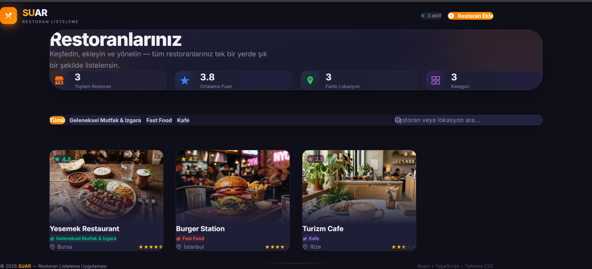
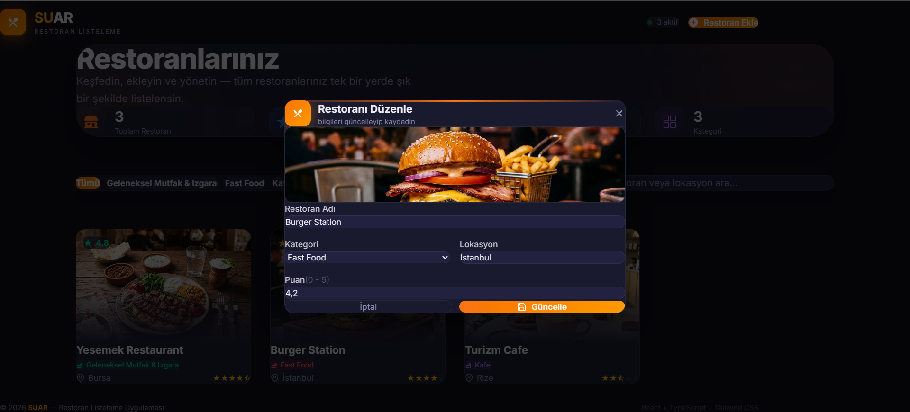
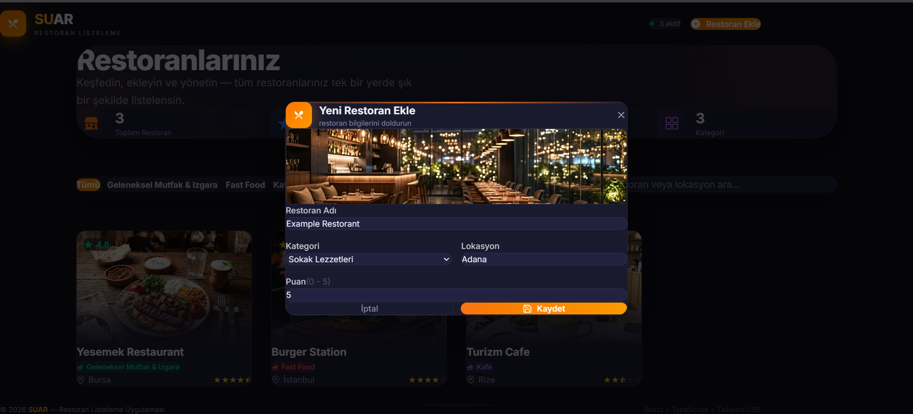
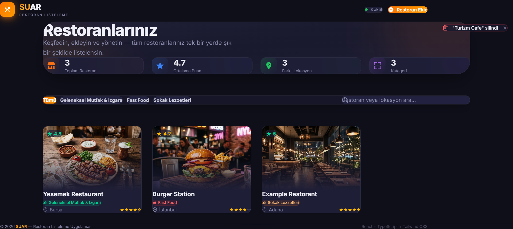
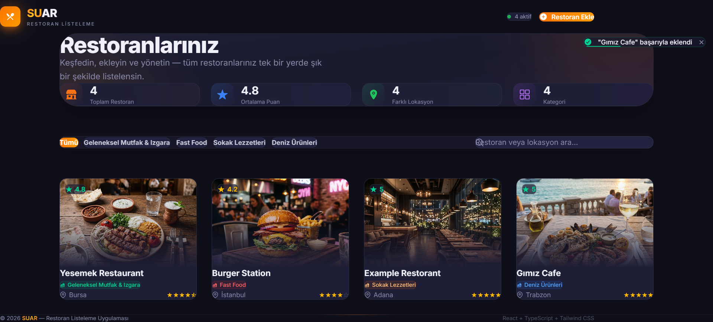

# SUAR - Restoran Listeleme Uygulaması

Modern, şık ve kullanıcı dostu bir restoran listeleme (CRUD) uygulaması. Restoranları ekleyebilir, silebilir, güncelleyebilir ve mevcut restoranlar arasında kategori, isim veya konuma göre filtreleme/arama yapabilirsiniz. 

## Proje Açıklaması

Bu proje, staj ve portfolyo gereksinimlerini karşılamak üzere geliştirilmiş profesyonel bir Frontend uygulamasıdır. "Glassmorphism" tasarım trendi kullanılarak, yapay zeka ile üretilmiş yüksek kaliteli restoran görselleri ile desteklenmiştir. Veriler tarayıcınızın `localStorage` alanında tutulur, böylece sayfayı yenilediğinizde bile bilgileriniz kaybolmaz.

## Ekran Görüntüleri

Aşağıda uygulamanın çeşitli özelliklerini ve modern arayüzünü gösteren örnek kareler yer almaktadır:

### 1. Ana Dashboard Görünümü
Genel istatistiklerinizi ve tüm restoranlarınızı tek bir geniş ve ferah pencerede görüntüleyin.


### 2. Akıllı Arama ve Filtreleme
Restoranları kategorilerine veya isimlerine göre anında filtreleyip bulmanızı sağlayan dinamik arama çubuğu.


### 3. Dinamik Formlar ve Restoran Ekleme
Glassmorphism tasarımıyla desteklenen zarif açılır pencereler (Modal) üzerinden yeni restoranlar ekleyin veya mevcutları güncelleyin.


### 4. Şık Kart Tasarımları
Her bir restoran; yıldız puanları, dinamik kategori etiketleri ve animasyonlu görselleriyle lüks bir kart tasarımında sunulur.


### 5. Kullanıcı Deneyimi ve Bildirimler
Kullanıcı hatalarını önlemek için tasarlanmış silme onayı pencereleri ve işlemlerin sonucunu bildiren Toast (bildirim) mesajları.


## Kullanılan Teknolojiler ve Sürümler

Proje en güncel web teknolojileri üzerine inşa edilmiştir:

- **React:** `^19.2.5`
- **TypeScript:** `~6.0.2`
- **Vite:** `^8.0.4`
- **Tailwind CSS:** `^4.2.2` (Özel `@theme` yapısıyla tamamen konfigüre edilmiştir)
- **React Icons:** `^5.6.0`

## Çalıştırma Adımları

Projeyi kendi bilgisayarınızda çalıştırmak için aşağıdaki adımları takip edebilirsiniz:

1. **Projeyi Klonlayın:**
   ```bash
   git clone https://github.com/kullanici_adiniz/SUAR.git
   ```

2. **Dizine Gidin:**
   ```bash
   cd SUAR
   ```

3. **Gerekli Paketleri Yükleyin:**
   ```bash
   npm install
   ```

4. **Geliştirme Sunucusunu Başlatın:**
   ```bash
   npm run dev
   ```

5. **Tarayıcıda Açın:**
   Uygulama başarıyla başlatıldığında terminalde beliren `http://localhost:5173` adresine giderek projeyi görüntüleyebilirsiniz.

---
*Not: Bu proje herhangi bir Backend'e ihtiyaç duymadan tamamen Client-side çalışmaktadır.*
